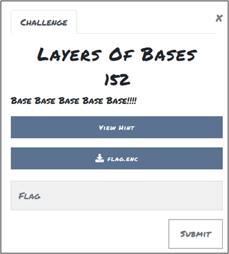
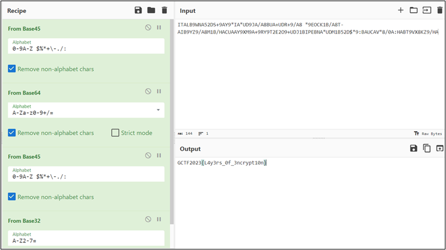

# Layers Of Bases

## Challenge: 

**Attachment:** flag.enc

## Solution: 

I randomly inputting several recipes in CyberChef for a while and managed to obtain the flag. 
The flag is decoded using Base45 twice, followed by Base64 and Base32. 

**Tool:** CyberChef - https://gchq.github.io/CyberChef/  

## Flag:
GCTF2023{L4y3rs_0f_3ncrypt10n} 
