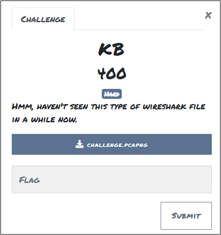
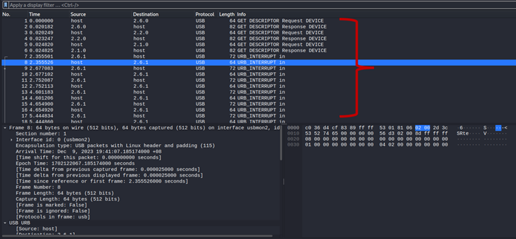
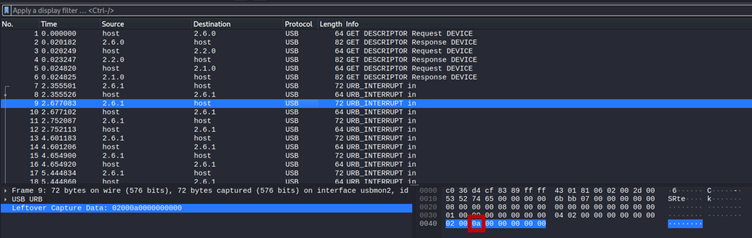
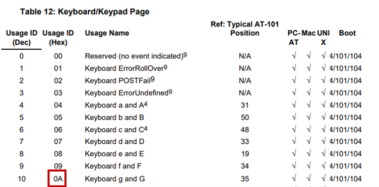
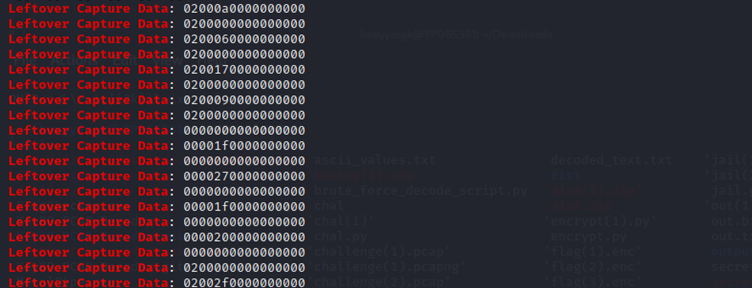
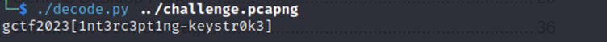

# KB

## Challenge: 

**Attachment:** challenge.pcapng

## Solution: 

Based on the image above, this challenge is with a PCAP file which means that requires to use of Wireshark or TShark. 

•	PCAP which means packet capture and this kind of file used to store the captured packet of data into a readable file. 

First, open the PCAP file with wireshark *$ wireshark challenge.pcapng* and determine the information in the file.

As you can see, this PCAP file contains the communication through the USB. In the Info column noticed that there are two different info. The relevant packet of the info that you should looking for were “**URB_INTERRUPT in**” packet. 

Noted:

•	Is it the Protocol is USB

•	The Source and Destination which is different and is using the two-way communication

The info with “**URB_INTERRUPT in**” packet consists of two type of packets which different in Source, Destination and the length. From the length column you could notice that two different types of packets which have the range of 8 bytes. Those packtes that with extra 8 bytes will have the “**Leftover Capture Data**” field.

From the data length that found in the “**Leftover Capture Data**” field can defined that it is keyboard packet as it consists of 8 bytes. Besides, for the keystroke is at the 3 bytes. Can determine the value by referring the table of key codes for the USB keyboard. The table can be found in https://www.usb.org/sites/default/files/documents/hut1_12v2.pdf.  

To view all the “**Leftover Capture Data**” field, can use the command *$ tshark –r filename.pcap -V | grep “Leftover Capture Data”* in Kali Linux terminal which can filter out all the data. 

To decode it in an easier and faster way, we found a pcap decode packages to be used. It can be found from here https://github.com/natesinger/KeyBD-PCAP-Decoder. After download this packages, you can used the command of *$ ./decode.py ../filename.pcap* to decode the key code and find out the flag.

By following the format of the flag set, the flag that decode should be changed as

•	“gctf” to “GCTF”

•	“[ ]” to “{ }”

•	“-” to “_”

**Tool:** Wireshark

## Flag:
GCTF2023{1nt3rc3pt1ng_keystr0k3}
