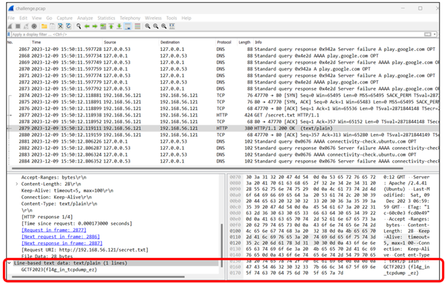
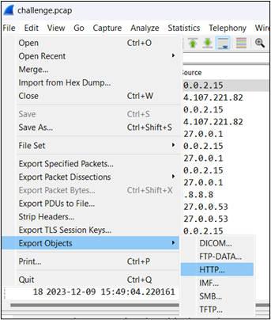
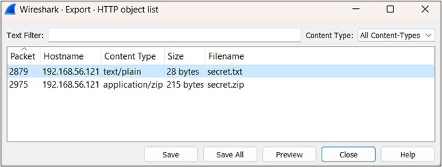
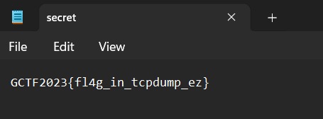

# Wireshark #1

## Challenge: 

**Attachment:** challenge.pcap

## Solution: 

At first, I use Wireshark to randomly scrolled and clicked to search for the flag. Luckily, I found it here:

Afterward, I realized that we could also export the TXT file by clicking “File”, “Export Objects”, and then “HTTP”. 

Click on packet 2879, and then click “Preview”. We can see the flag in the secret.txt file. 

**Tool:** Wireshark

## Flag:
GCTF2023{fl4g_in_tcpdump_ez} 