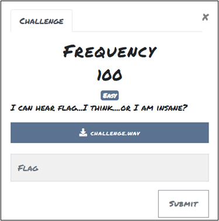
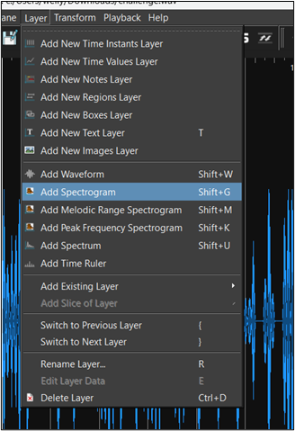
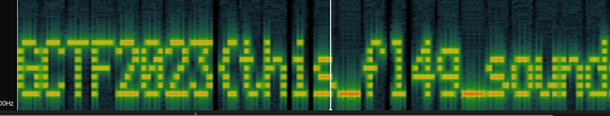
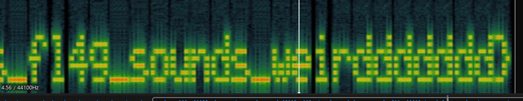

# Frequency

## Challenge: 

**Attachment:** challenge.wav

## Solution: 

Open the audio file in Sonic Visualiser. Then, add a spectrogram. 

The flag is displayed. 

**Tool:** Sonic Visualiser 

## Flag:
GCTF2023{this_fl4g_sounds_weirddddddd} 
