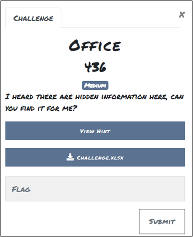
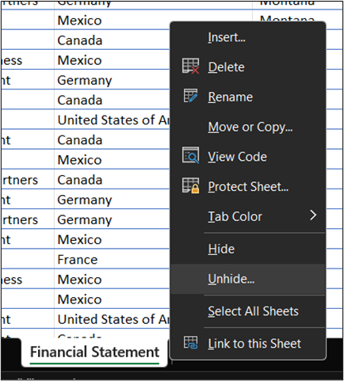
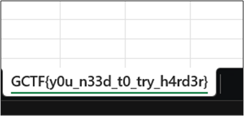
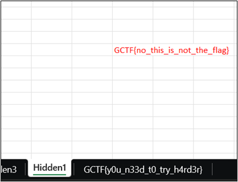
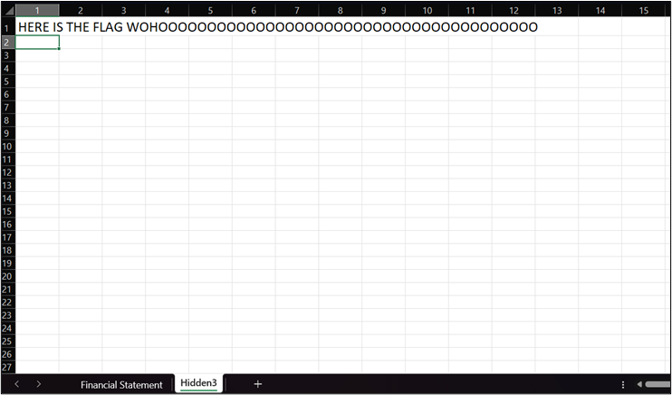
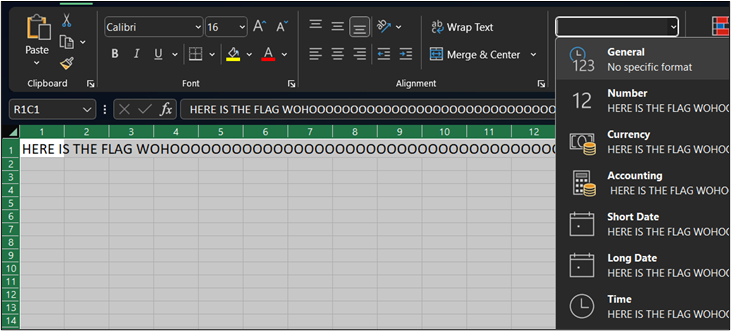
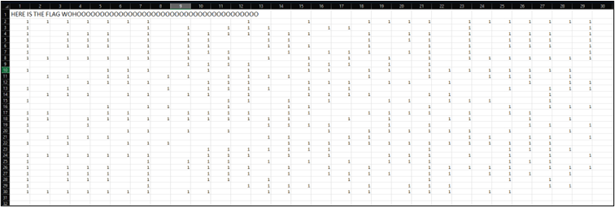
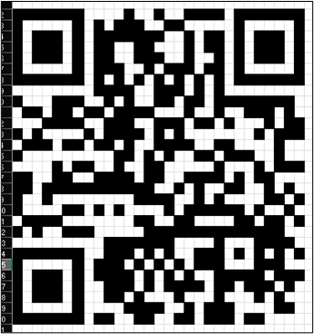
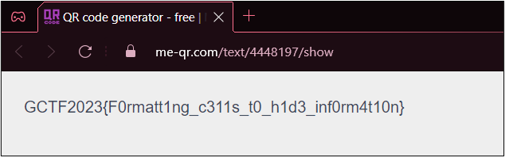

# Office 

## Challenge: 

**Attachment:** Challenge.xlsx

## Solution: 
Unhide the sheets in the Challenge.xlsx Excel workbook.  

This tab name is not the correct flag.  

The correct flag is not on this “Hidden 1” tab either. 

Click on the “Hidden3” tab. 

Select all cells and choose the number format as “General”. 

We can notice that there are many cells with the number “1”. 

Fill the cells containing “1” with black color to reveal a QR Code. 

 
Scan the QR Code to retrieve the flag.
https://me-qr.com/text/4448197/show 

## Flag:
GCTF2023{F0rmatt1ng_c311s_t0_h1d3_inf0rm4t10n} 
