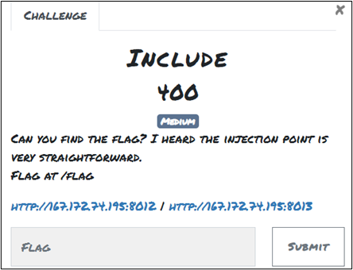
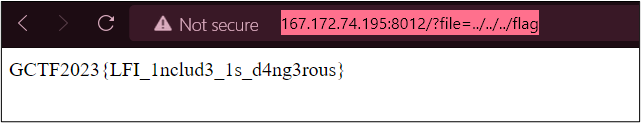

# Include

## Challenge: 

## Solution: 

 

After clicking “HERE” on the given link, it will direct us to another link that shows the flag is not there. 

 

I’m not familiar with web challenges, but I think it involves Local File Inclusion (LFI) because the challenge title mentions “Include”. The description also states that “flag at /flag”. So, I added the path to /flag. I tried to navigate to the correct directory by adding a few “../” in front of “flag” in the link until I reached the correct location. 

The link that displays the flag is http://167.172.74.195:8012/?file=../../../flag. 

 

## Flag:
GCTF2023{LFI_1nclud3_1s_d4ng3rous} 
