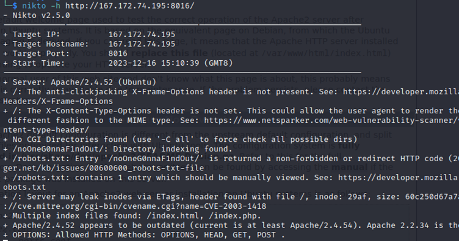
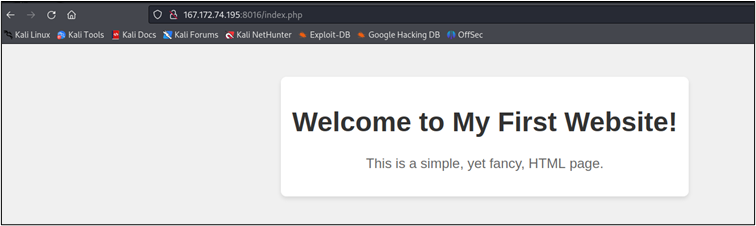
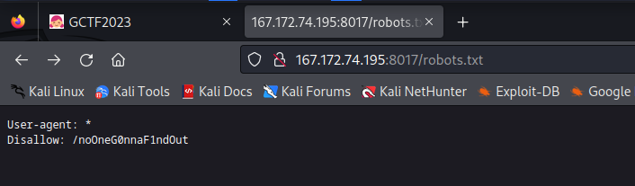
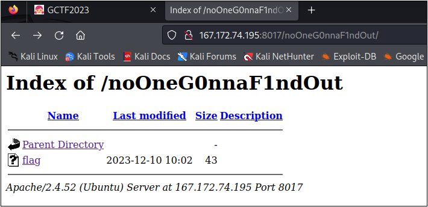
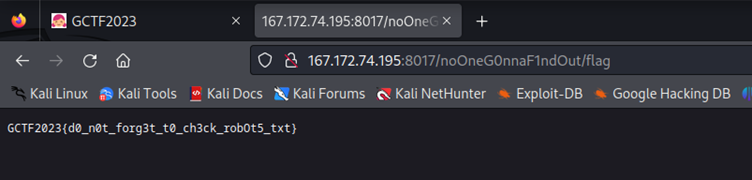

# Secret

## Challenge: 

## Solution: 

As the question mentioned that hidden pages. To determine that can use the nikto which is an open-source web server scanner. It functions as examines a website and reports back vulnerabilities. By using the command *# nikto -h $webserverurl*, the output provided the page that is hidden.  

From the above image, you can determine that there are multiple index files which are/index.html and /index.php. The /index.php is the hidden page. Added /index.php at the end of the link. Besides that, there is also a robots.txt which is probably next page that looking for.

The page with /robots.txt will show all the page that does not allow someone to see it. In the picture, we know that the page that disallows to see is /noOneG0nnaF1ndOut and that page might have the flag.

We found a hidden page named the flag and it is probably the last page of the website to find out. 

Here you go for the flag.

## Flag:
GCTF2023{d0_n0t_forg3t_t0_ch3ck_robOt5_txt} 